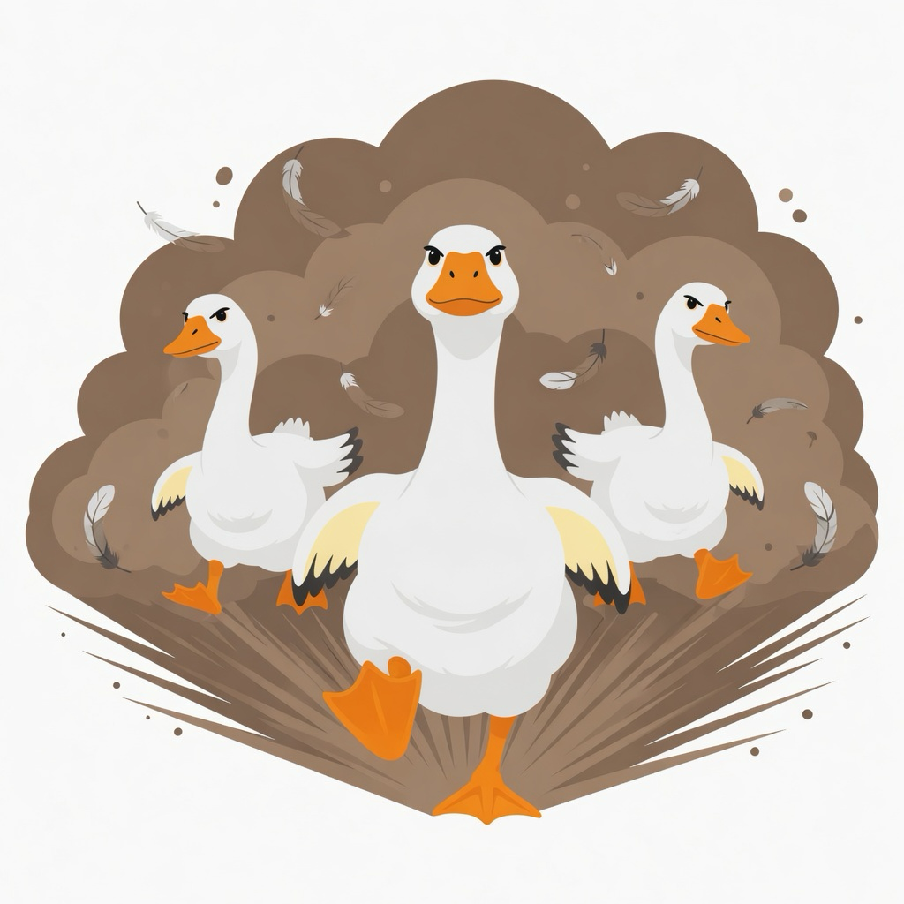

# Gaggle

<p align="center">
  
</p>

A **gaggle** is a flock of geese. This one is a flock of
[goose](https://github.com/aaif-goose/goose) agents, herded by a small
Rust harness that turns code review into an unattended loop.

Point it at a git repository and it walks every component — reviewing,
fixing, verifying, and committing — while you do something better with
your time. Goose is the agent runtime; gaggle owns the boring, dangerous
parts (git, tests, state) so the agents only read and write code.

```
gaggle run
  └─ for each component:
       review  → an agent reads the code and reports findings
       fix     → an agent fixes them (updating call sites and tests too)
       verify  → the HARNESS runs your build/test commands, not the agent
       commit  → the HARNESS commits on green (the agent never touches git)
       confirm → an agent re-checks that the findings actually closed
```

## Why

Code review is one of the highest-leverage quality practices we have —
and one of the first things cut when deadlines loom. The deep, patient
pass over every error path and edge case is exactly the work AI agents
are good at and humans skip.

gaggle is not a chat window. It is a loop you can leave running for
hours over a whole repository, that commits its work in small reviewable
chunks and tells you honestly what it could not fix.

**Design principles:**

- **The harness is in charge.** Agents propose; the harness decides.
  State transitions, verify gates, and git commits live in deterministic
  Rust code. An agent cannot mark its own work green or commit.
- **Verify is the gate.** Pass/fail comes from the *exit codes* of your
  configured build/test commands — never from an agent claiming success.
- **One work order per review.** A review produces a numbered findings
  list; fixes work through *that list*. No re-reviewing from scratch
  after every fix (that treadmill never converges).
- **Commit on the first green verify.** Keep wins. Later failures restore
  the last green state instead of throwing away good work.
- **Failure is quarantined, not fatal.** A component that cannot be fixed
  within its budget of cycles is parked with its findings intact and the
  loop moves on. `gaggle requeue` brings it back when you're ready.

## Quick start

Requires [Rust](https://rustup.rs) (to build) and the
[goose CLI](https://goose-docs.ai/docs/getting-started/installation)
on your `PATH`, configured with a working provider (`goose configure`).

```bash
cargo install --path .          # puts `gaggle` on your PATH
cd your-repo                    # any git repo with at least one commit
gaggle init                     # AI discovers the components; writes .review/
gaggle run                      # the full loop
```

Prebuilt binaries for Linux, macOS, and Windows are attached to
[GitHub Releases](https://github.com/amscotti/gaggle/releases) when a
`v*.*.*` tag is pushed. The tag must match the `version` in `Cargo.toml`.

Prefer to just see what it finds, without letting it change anything?

```bash
gaggle run --review-only
```

Watch a running loop from another shell with `gaggle status`, or
`tail -f .review/activity.log`.

## What a run looks like

```
=== game-engine — Game state machine ===
  review: 5 finding(s)
  fix 1: fixed
  verify: PASS
  commit: 01e5bc0
  confirm: 0 still open
  ✓ game-engine: fixed + committed 01e5bc0
```

When the loop finishes, `.review/final-report.md` summarizes the run —
facts (components, commits, cost) computed by the harness, open questions
(the decisions a human should make) synthesized by an agent:

```
## Run summary
- reviewed: 15 of 15 components
- fixed+committed: 15: ...
- needs-decision: 0
- final verify: PASS
- model: custom_deepseek / deepseek-v4-flash
- usage: $0.0131 / 426,940 in / 35,511 out / 412,672 cache-read
```

## Commands

| Command | What it does |
|---|---|
| `gaggle init` | Discover components (or pin them with `--components "slug\|Name\|tier,…"`) and scaffold `.review/` |
| `gaggle run` | The full loop: review → fix → verify → commit → confirm, per component |
| `gaggle run --review-only` | Review every component and record findings; never fix or commit |
| `gaggle status` | What the loop is doing right now (+ recent activity) |
| `gaggle list` | Component table: phase, findings, outcome per component |
| `gaggle history` | Past runs (outcome, cost, leftovers); `gaggle history <run-id>` replays a run's full report |
| `gaggle requeue <slug>… \| --all` | Move quarantined components back to pending for retry |
| `gaggle model` | Print the effective agent model and where it comes from |

All run state lives under `.review/` in the target repo. `gaggle init`
appends gitignore rules that keep `config.toml`, `checklist.md`, and
`workflows/` trackable and ignore the rest (state, findings, logs,
archives). Every finished run is archived under
`.review/runs/<timestamp>/` (report, ledger, state snapshot, cost) for
post-mortems: `gaggle history` summarizes them at a glance. Delete the
directory and you're back to a clean slate.

## Configuration

Everything is a single file, `.review/config.toml`. `gaggle init` writes
sensible defaults (it detects Go, Rust, npm, and pytest projects) and
warns loudly when it cannot. A commented template lives in
[`config.toml.example`](config.toml.example).

```toml
# What the harness runs to verify a fix. Exit codes decide everything.
verify = ["cargo build", "cargo test"]

# Optional: the expensive full suite, run ONCE at the end of the run
# (per-cycle verifies are scoped, then this file's `verify` list).
# final_verify = ["cargo build --workspace", "cargo test --workspace"]

# Which model the agents use. Falls back to goose's configured default
# when unset — nothing is hard-coded.
[model]
provider = "custom_z.ai"
model = "glm-5.3"

# Per-phase overrides: e.g. a thorough reviewer with a fast fixer.
# Unset keys inherit from the base above.
# [model.fix]
# provider = "custom_deepseek"
# model = "deepseek-v4-flash"

# Commit on a dedicated branch instead of the current one, so a whole
# run can be merged or reverted as a unit.
# [branch]
# dedicated = true

[commit]
sign = false
```

Top-level keys (`verify`, `final_verify`) must sit *before* any
`[section]` header, or TOML will nest them under the last table.

## How it decides things

- **Components** — the unit of work: a coherent slice of the codebase
  (a crate, a package, a module group). AI discovery proposes them; the
  harness validates and normalizes. Override with `--components` if you
  know better.
- **Phases** — every component walks
  `pending → reviewing → fixing → verifying → committing → done`.
  A component that exhausts its fix cycles (3) or fails a phase is
  quarantined in `failed` until requeued. Quarantine does not fail the
  process; a red `final_verify` does.
- **Resume** — the loop is crash-safe. Any interruption (kill, reboot,
  timeout) resets the in-flight component to `pending`, wipes uncommitted
  fixer changes, keeps every committed green state, and picks up where
  it left off on the next `gaggle run`.
- **Verify scoping** — each fix cycle runs a scoped check when one can
  be derived (`go test ./pkg…`, `cargo test -p crate…`), then the
  configured `verify` list. An optional `final_verify` runs once at the
  end of the run for suites too slow to repeat. A red final gate is
  reported honestly and fails the run's exit code.
- **Recipes** — each phase's agent instructions are plain goose recipe
  YAML, baked into the binary. Drop a file with the same name into
  `.review/workflows/` to override any of them for your repo.
- **Timeouts** — every agent subprocess is bounded (60 min by default;
  `GAGGLE_GOOSE_TIMEOUT_SECS`) and killed with its whole process group,
  so a hung agent can never wedge the loop.

## Project layout

```
src/loop_engine.rs   the state machine and per-component flow
src/goose.rs         agent driver: one goose subprocess per phase
src/recipes.rs       embedded recipes + .review/ scaffolding
src/verify.rs        the verify gate (scoped + final)
src/commit.rs        git ownership: staging, commits, resets, branches
src/state.rs         resumable per-component state
src/checklist.rs     the human-readable checklist format
src/discover.rs      AI component discovery, validated by the harness
src/status.rs        live status.json + activity.log
workflows/*.yaml     the agent instructions (review, fix, confirm, …)
```
